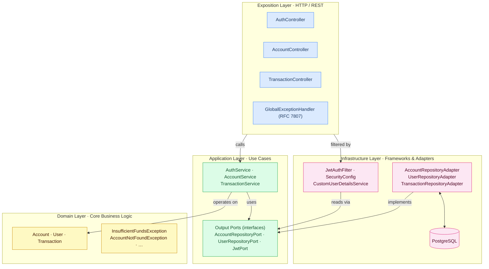
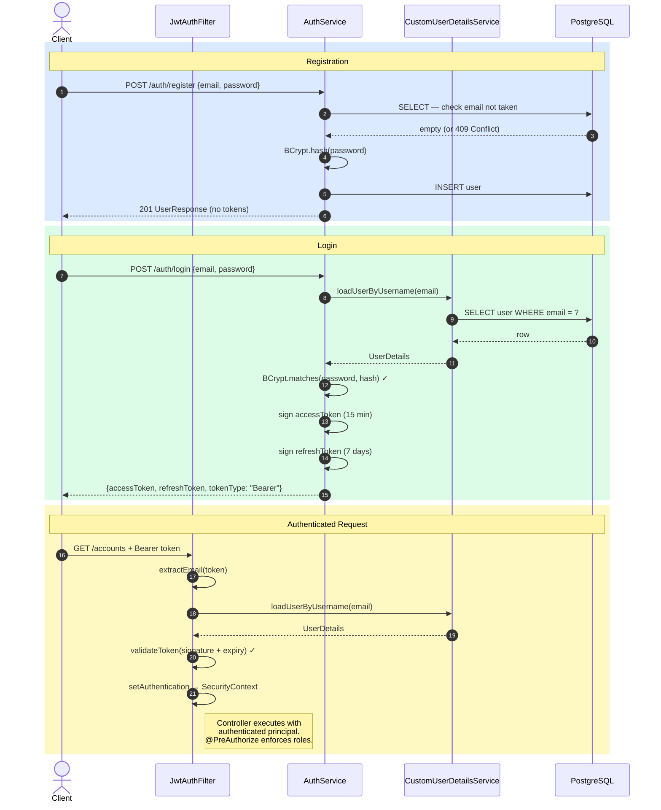

# payment-account-api


A production-grade REST API for payment account management, built with Spring Boot 3, JWT authentication, role-based access control, and Clean Architecture (DDD).

Built as a project showcasing enterprise-grade Java backend development skills applicable to fintech, banking, and SaaS platforms.

---

## Architecture

Multi-module Maven project following **Clean Architecture** (Hexagonal / Ports & Adapters).
Dependency rule flows strictly inward — outer layers depend on inner ones, never the reverse.



| Module | Responsibility |
|--------|---------------|
| `domain` | Pure domain models (`Account`, `User`, `Transaction`, enums) and domain exceptions. No Spring, no JPA. |
| `application` | Use-case services (`AccountService`, `AuthService`, `TransactionService`), DTOs, and output port interfaces (`AccountRepositoryPort`, `JwtPort`). |
| `infrastructure` | Port implementations: JPA entities, Spring Data repositories, adapters, `JwtService`, `CustomUserDetailsService`, `SecurityConfig`. |
| `exposition` | REST controllers, `GlobalExceptionHandler`, OpenAPI config, and `PaymentAccountApplication` entry point. |

---

## Features

| Feature | Details |
|---|---|
| **JWT Authentication** | Access token (15 min) + Refresh token (7 days) |
| **Role-based access** | USER / ADMIN with `@PreAuthorize` and method security |
| **Account management** | CRUD with business rules (credit, debit, suspend, close) |
| **Pagination** | All list endpoints paginated via Spring `Pageable` |
| **Transaction history** | Filterable by type (CREDIT / DEBIT), sorted, paginated |
| **Validation** | Bean Validation on all request bodies |
| **Error handling** | RFC 7807 `ProblemDetail` responses for all error types |
| **API docs** | OpenAPI 3 / Swagger UI — fully authenticated |
| **Tests** | 22 test cases: 3 unit classes (Mockito) + 3 integration classes (MockMvc + Testcontainers) |

---

## Tech Stack

- **Java 21** — Records, sealed interfaces, virtual threads, modern idioms
- **Spring Boot 3.3** — Web, Security, Validation, Actuator
- **Spring Security 6** — JWT filter chain, `@EnableMethodSecurity`
- **JJWT 0.12.3** — Access + refresh token generation and validation
- **Spring Data JPA** — PostgreSQL persistence with pagination
- **SpringDoc OpenAPI 2.5** — Swagger UI at `/swagger-ui.html`
- **Testcontainers 1.19** — Real PostgreSQL in integration tests
- **Docker / Docker Compose** — One-command local setup

---

## Getting Started

### Prerequisites
- Java 21+
- Maven 3.9+
- Docker & Docker Compose (required for integration tests and local PostgreSQL)

### Run locally

```bash
# 1. Clone the repo
git clone https://github.com/M-Touiti/payment-account-api.git
cd payment-account-api

# 2. Start PostgreSQL
docker-compose up -d postgres

# 3. Build and run
mvn clean install -DskipTests
mvn spring-boot:run -pl exposition

# 4. Open Swagger UI
# http://localhost:8080/swagger-ui.html
```

### Run tests

```bash
# All unit tests (no Docker required)
mvn test -pl exposition -Dtest="AccountServiceTest,AuthServiceTest,TransactionServiceTest"

# Full test suite including integration tests (requires Docker)
mvn test -pl exposition

# All modules
mvn test
```

Integration tests use Testcontainers and spin up a real PostgreSQL container automatically. They are skipped when Docker is unavailable (`@Testcontainers(disabledWithoutDocker = true)`).

---

## API Reference

### Authentication

| Method | Endpoint | Auth | Description |
|---|---|---|---|
| POST | `/api/v1/auth/register` | ❌ | Register new user |
| POST | `/api/v1/auth/login` | ❌ | Login → JWT tokens |
| POST | `/api/v1/auth/refresh` | ❌ | Refresh access token |

### Accounts

| Method | Endpoint | Role | Description |
|---|---|---|---|
| POST | `/api/v1/accounts` | USER | Create account |
| GET | `/api/v1/accounts/me` | USER | My accounts (paginated) |
| GET | `/api/v1/accounts/{id}` | USER/ADMIN | Get account by ID |
| GET | `/api/v1/accounts` | ADMIN | All accounts (paginated) |
| PATCH | `/api/v1/accounts/{id}/suspend` | USER/ADMIN | Suspend account |
| DELETE | `/api/v1/accounts/{id}` | ADMIN | Close account |

### Transactions

| Method | Endpoint | Auth | Description |
|---|---|---|---|
| POST | `/api/v1/accounts/{id}/transactions` | USER | CREDIT or DEBIT |
| GET | `/api/v1/accounts/{id}/transactions` | USER | List (paginated, filterable) |

### Public endpoints

| Endpoint | Description |
|---|---|
| `/actuator/health` | Application health check |
| `/swagger-ui.html` | Swagger UI |
| `/v3/api-docs/**` | OpenAPI spec |

### Pagination parameters

All list endpoints support standard Spring pagination:
```
GET /api/v1/accounts/me?page=0&size=10&sort=createdAt,desc
GET /api/v1/accounts/{id}/transactions?type=CREDIT&page=0&size=20
```

---

## Example Requests

### Register
```bash
curl -X POST http://localhost:8080/api/v1/auth/register \
  -H "Content-Type: application/json" \
  -d '{"email": "user@example.com", "password": "password123"}'
```

### Login
```bash
curl -X POST http://localhost:8080/api/v1/auth/login \
  -H "Content-Type: application/json" \
  -d '{"email": "user@example.com", "password": "password123"}'
```

### Create Account
```bash
curl -X POST http://localhost:8080/api/v1/accounts \
  -H "Authorization: Bearer <access_token>" \
  -H "Content-Type: application/json" \
  -d '{"type": "CHECKING", "currency": "EUR"}'
```

### Credit Transaction
```bash
curl -X POST http://localhost:8080/api/v1/accounts/{accountId}/transactions \
  -H "Authorization: Bearer <access_token>" \
  -H "Content-Type: application/json" \
  -d '{"type": "CREDIT", "amount": 500.00, "description": "Initial deposit"}'
```

---

## Authentication Flow



---

## Error Responses (RFC 7807)

All errors follow the standard `application/problem+json` format:

```json
{
  "type": "/errors/validation",
  "title": "Validation Failed",
  "status": 400,
  "errors": {
    "email": "must be a well-formed email address"
  },
  "timestamp": "2025-06-01T14:32:00Z"
}
```

| Exception | HTTP Status |
|---|---|
| `MethodArgumentNotValidException` | 400 Bad Request |
| `AccountNotFoundException` | 404 Not Found |
| `UserAlreadyExistsException` | 409 Conflict |
| `InsufficientFundsException` | 422 Unprocessable Entity |
| `UnauthorizedAccessException` / `AccessDeniedException` | 403 Forbidden |
| `BadCredentialsException` | 401 Unauthorized |
| Unhandled exceptions | 500 Internal Server Error |

---

## Project Structure

```
payment-account-api/
├── domain/                          # Pure business logic
│   ├── model/   Account, User, Transaction, enums
│   └── exception/
├── application/                     # Use cases + ports
│   ├── service/  AuthService, AccountService, TransactionService
│   ├── port/out/  AccountRepositoryPort, UserRepositoryPort, JwtPort
│   └── dto/request|response/
├── infrastructure/                  # Adapters
│   ├── security/  JwtService, JwtAuthenticationFilter,
│   │              CustomUserDetailsService, SecurityConfig
│   └── persistence/  JPA entities, repositories, adapters
├── exposition/                      # REST + entry point
│   ├── controller/  AuthController, AccountController, TransactionController
│   ├── exception/  GlobalExceptionHandler
│   ├── config/  OpenApiConfig
│   └── src/test/
│       ├── unit/        AccountServiceTest, AuthServiceTest,
│       │                TransactionServiceTest
│       └── integration/ AuthControllerIntegrationTest,
│                        AccountControllerIntegrationTest,
│                        TransactionControllerIntegrationTest
├── docker/init.sql
├── .github/workflows/ci.yml
├── .env.example
├── docker-compose.yml
└── Dockerfile
```

---

## Design Decisions

**Why RFC 7807 ProblemDetail?**
Spring 6 natively supports `ProblemDetail`, providing a standardized error response format across all endpoints — consistent for API consumers without any custom serialization code.

**Why separate access + refresh tokens?**
Short-lived access tokens (15 min) reduce the attack window if intercepted. Refresh tokens (7 days) allow seamless session renewal without re-authentication, stored securely client-side.

**Why NUMERIC(19,4) for monetary amounts?**
Floating-point types (DOUBLE, FLOAT) cannot represent all decimal values exactly. `BigDecimal` in Java + `NUMERIC(19,4)` in PostgreSQL guarantees exact arithmetic — critical for financial systems.

**Why `CustomUserDetailsService`?**
Spring Security's `DaoAuthenticationProvider` requires a `UserDetailsService`. The custom implementation loads users by email (rather than username) from the domain's `UserRepositoryPort`, keeping the security layer properly wired to the Clean Architecture port — no direct JPA dependency in the security config.

---

## License

MIT
